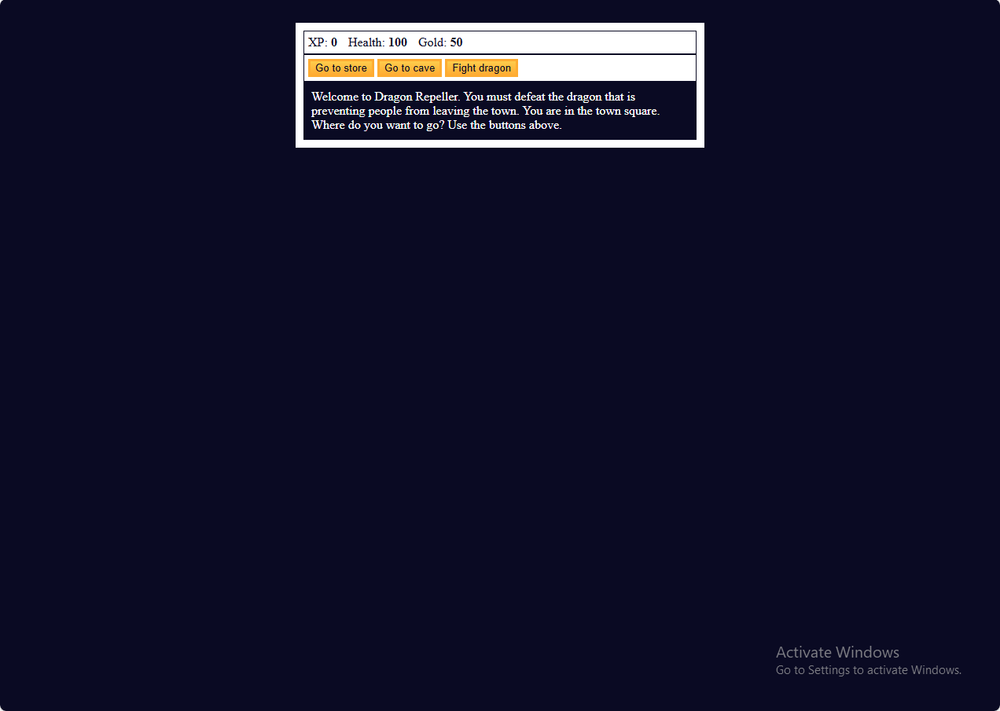

# 🐉 Dragon Repeller RPG



A vanilla JavaScript text-based RPG where players battle monsters, manage resources, and strategize to defeat the final dragon.

## ✨ Features
- 🗡️ Dynamic combat system (attack/dodge mechanics)
- 💰 Resource management (XP, gold, health)
- 🛒 Shop system for weapons and upgrades
- 👹 3 unique monster types with varying difficulty
- 🏆 Win/lose conditions with restart functionality
- 📱 Responsive design for all screen sizes

## 🛠 Tech Stack


## 🚀 Quick Start
```bash
git clone https://github.com/AbdulrahmanFrontend/js-text-rpg.git
cd js-text-rpg
open index.html
```

🎮 Gameplay Guide
1. Start in Town Square - Your adventure begins here
2. Explore the Cave - Fight monsters to gain XP and gold
3. Visit the Store - Upgrade weapons and replenish health
4. Battle the Dragon - Defeat the final boss to win!

📂 Project Structure
```text
js-text-rpg/
├── index.html          # Core HTML structure
├── styles.css          # Game styling and layout
├── script.js           # Game logic and mechanics
├── README.md           # Project documentation
└── screenshot.png      # Game preview
```

🔍 Key Code Implementation
```javascript
// Preparing key events
const button1 = document.querySelector('#button1');
const button2 = document.querySelector('#button2');
const button3 = document.querySelector('#button3');

button1.onclick = goStore;    // Interact with the store
button2.onclick = goCave;     // Interact with the cave
button3.onclick = fightDragon; // Interact with the dragon
// Primary interface update function
function update(location) {
  monsterStats.style.display = "none";
  button1.innerText = location["button text"][0];
  button2.innerText = location["button text"][1];
  button3.innerText = location["button text"][2];
  button1.onclick = location["button functions"][0];
  button2.onclick = location["button functions"][1];
  button3.onclick = location["button functions"][2];
  text.innerHTML = location.text;
}
```

🌐 Live Demo
https://img.shields.io/badge/Play-Live_Demo-2ea44f

📜 Development Notes
- Implemented game state management using vanilla JS
- Developed dynamic UI updates through DOM manipulation
- Designed responsive layout with CSS Flexbox
- Optimized event handling for smooth gameplay
